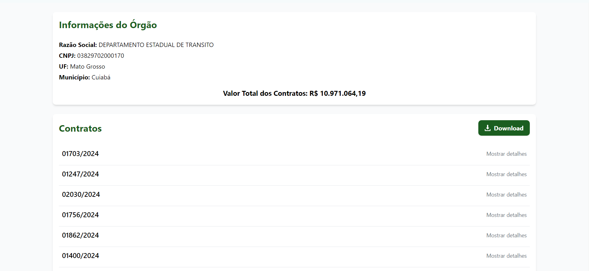
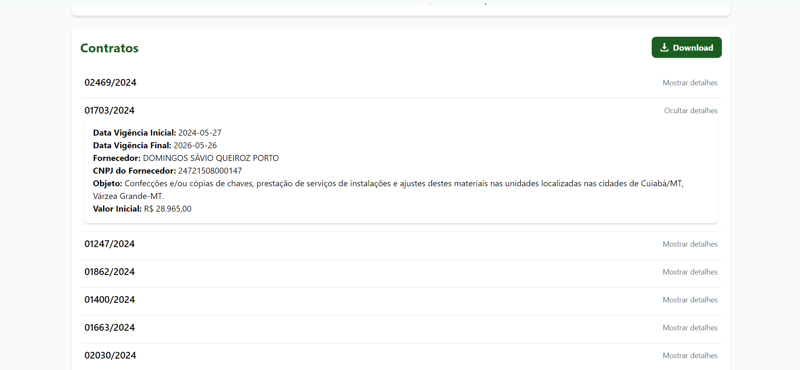

# OrgSearch

OrgSearch é uma aplicação web desenvolvida em React onde consulta de contratos de órgãos públicos. A aplicação consome a API do Portal Nacional de Contratações Públicas (PNCP) para obter informações de contratos do órgão desejado a partir do seu CNPJ e de um período específico informado.

## Funcionalidades

- Consulta informações de um órgão público a partir do CNPJ como: razao social, nome de unidade federativa e município.
- Exibe uma lista de contratos do órgão com informações detalhadas como: numero de empenho, data de inicio e fim da vigencia, razão social do fornecedor, objeto contratado e valor inicial.
- Permite ao usuário o download do arquivo .JSON dos dados encontratos.

## Tecnologias Utilizadas

- **React**: Biblioteca JavaScript para criação da interface de usuário.
- **TypeScript**: Superset de JavaScript que adiciona tipagem estática ao código.
- **Axios**: Cliente HTTP usado para realizar as requisições à API do PNCP.
- **Tailwind CSS**: Framework CSS utilizado para estilização da interface.

## Como Rodar o Projeto Localmente

### Pré-requisitos

- Node.js e npm instalados.

### Passo a passo

1. **Clone o Repositório:**

   git clone https://github.com/naoentendotu/OrgSearch.git
   cd OrgSearch

2. **Instalações Necessárias:**

    npm install
    npm start

3. **Acesse**

    Abra o navegador e acesse: http://localhost:3000.

## Configuração do Proxy

Durante o desenvolvimento, um proxy foi configurado no arquivo package.json para evitar problemas com CORS ao consumir a API do PNCP:

    "proxy": "https://pncp.gov.br"

## Estrutura do Projeto

    src/
    ├── api/
    │   └── pncpAPI.ts          
    ├── components/
    │   └── Search.tsx          
    ├── tipos/
    │   └── index.ts            
    └── App.tsx                 

## Screenshots

### Página Inicial com Campo de Busca

### Resultado da Busca

### Detalhes de Contrato

